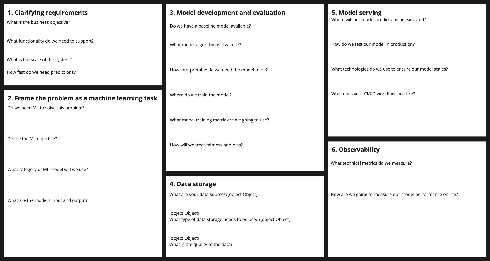
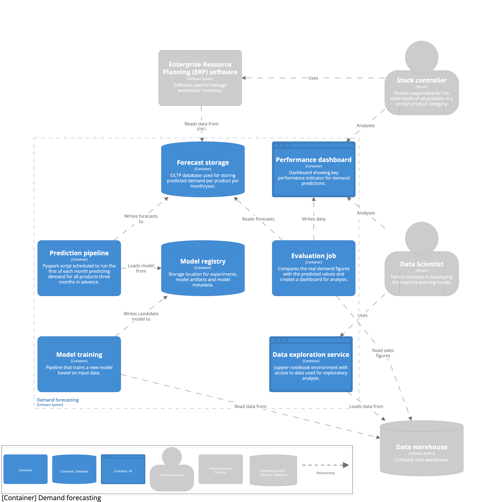
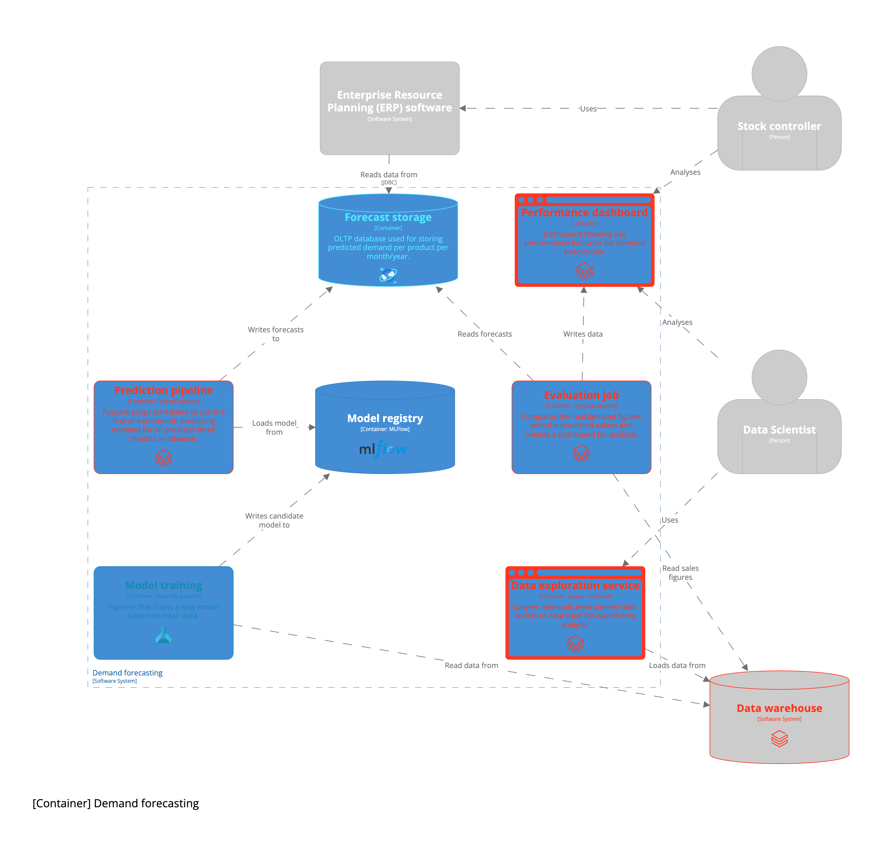
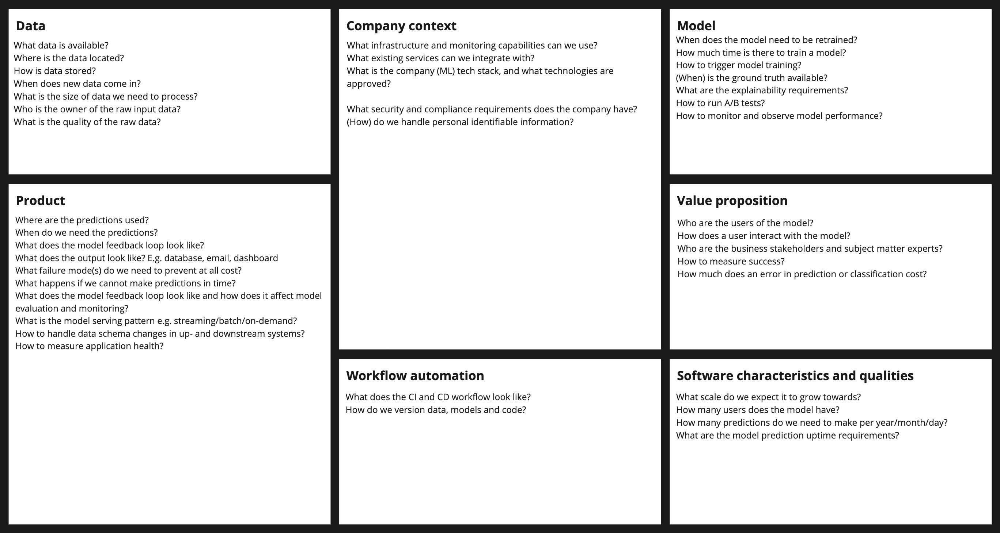

With the industry moving towards end-to-end ML teams to enable them to implement MLOps practices, it is paramount to look past the model and view the entire system around your machine learning model. The classic article on [Hidden Technical Debt in Machine Learning Systems](https://proceedings.neurips.cc/paper_files/paper/2015/file/86df7dcfd896fcaf2674f757a2463eba-Paper.pdf) explains how small the model is compared to the system it operates in. Therefor, to maintain an ML product, we need to understand the system around the machine learning model, view it holistically, and design accordingly. 

This blogpost illustrates the steps of the design process. A demand forecasting case will be used to demonstrate the process. Demand forecasting is chosen because it’s a very tangible problem and very suitable application for machine learning.  

## Table of Contents

- [What is Machine Learning System Design?](#what-is-machine-learning-system-design)
- [Design Process](#design-process)
    - [Clarify requirements](#clarify-requirements-and-frame-as-ml-task)
    - [Frame problem as an ML task](#clarify-requirements-and-frame-as-ml-task)
    - [Identify data sources and their availability](#identify-data-sources-and-their-availability)
    - [Model development](#model-development)
    - [Serve predictions](#serving-your-predictions)
    - [Observability](#observability)
- [Iterate on your design](#iterate)

## What is Machine Learning System Design?
Machine Learning System Design is the iterative process of defining a software architecture. It consists of:

- isolated building blocks
- interactions between these building blocks
- data flowing through the building blocks

The system is designed by analyzing business requirements and the context of an organization.

The design process is iterative because the environment and business requirements can change, affecting the architecture of your system. The isolated building blocks are the individual applications that will run within your system. It is important to focus on the data flow, as this is what distinguishes Machine Learning Systems from regular Software Systems. Business requirements dictate if and how your model will add value for your company. Finally, the most important and often overlooked part is the context of the organization you work in. An organization may have decided on part of the technology stack constraining your design. Besides, there can be cross-cutting concerns like security and privacy your design must abide by. If two companies design a system with the same business requirements, the end result may look completely different. The goal of Machine Learning System design is to communicate trade-offs you make and identify bottlenecks in your system.

## Design process
There is no single way to do system design. Here I propose a sequence of steps you can follow to create a system design. The process of designing an ML system can be divided into sequential topics that address different parts of the system. System design is an iterative process, it is never finished as requirements may change. More about this later in this post.

1. [Clarify requirements](#clarify-requirements-and-frame-as-ml-task)
1. [Frame problem as an ML task](#clarify-requirements-and-frame-as-ml-task)
1. [Identify data sources and their availability](#identify-data-sources-and-their-availability)
1. [Model development](#model-development)
1. [Serve predictions](#serving-your-predictions)
1. [Observability](#observability)

The Machine Learning System Design canvas below can be used as a handle during a design to keep track of decisions. It contains questions that can guide you through the design process. Their relevance will be explained throughout this blog.

### Clarify requirements and frame as ML task
Designing an ML system is a technical exercise. But, including business people like Product Managers, Subject Matter Experts, or other stakeholders will ensure your technical design meets business needs. They will help you clarifying your business requirements. It is your job to clarify the requirements set by business and translate them to technical specifications. Often, requirements are not clear enough at the start. You need to refine them with business to frame the problem as something that is solvable with ML. 
At the end of this exercise you should know:

- What features will my system will support?
- How will the user interact with the predictions? 
- How many predictions are made within what timeframe?
- What business and ML objective will be optimized for?

#### Example
Your company asks you to optimize their warehouse inventory because they often have too many or too few products in stock. In itself, this is not a Machine learning task, so let's reframe the problem. We can predict item demand as a regression problem, which will help determine when to make new purchases. The company has *P* products and places monthly orders with a three-month lead time, so we'll need to make 3 x *P* predictions each month.

The scope of the design is clear now. Expanding this sections shows what the full worked out design looks like.

 

### Identify data sources and their availability
We need to identify what our data sources, what the type of data is, and what its quality is. Our data sources tell us what data we have, where it is stored, and who owns it. You need to verify the data resides in a system that is suitable for analytical workloads, like a data warehouse. Data lineage is another important factor, so you know what system produced the data and know who to contact when data is not up to quality standards. The frequency by which new data comes in will dictate how often you can retrain your model. Do we have ground truth labels available for the data, and when do these labels become available?
This also is the stage where you can explore features that are likely to have much predictive power and identify if data is available for them. Do we have data available at the right granularity level? You will need to do some form of preprocessing and feature engineering. Where will you store this processed data?

#### Example
In the previous section we said we need to create monthly predictions. We need to make sure new data arrives with this frequency. We have the ground truth labels at the end of each month when the sales figures come in. Since we are talking about a fictive use case we need to make some assumption here. In our use case we may need to remove some outliers and months for which we had low sales figures due to of products being out of stock. We will have to aggregate our data on month level, because our sales figures are presented on daily level. The processed data will be stored in the same data warehouse where we fetched the raw data from.

### Model development
This part is what Data Scientists are most comfortable with. We have identified the data sources and metrics to optimize the model for. We need to decide how we are going to split the data into train, test, and validation datasets. If a baseline model is available, it sets the target to beat. If not, this is also the stage to determine the minimum metrics your initial model should achieve. You want to design a setup that allows you to test various models and different sets of features. Where will you train your models and how do you collaboratively develop them? How does your model handle the cold start problem when there is insufficient input data for predictions? 
You will identify a few model algorithms to start experimenting with. You may want to take into account explainability, fairness and bias requirements of your model, this may restrict the model options you have. Here, I will not discuss these topics. The model you choose may enforce specific training infrastructure requirements. 
At this stage you may realize ML is not required for the problem you're trying to solve. ML introduces much complexity to a system, and should be avoided if possible.

#### Example
In this case we will assume there is a baseline model that is a weighted moving average of the past few months. We can start with a simple statistical univariate models like [Prophet](https://en.wikipedia.org/wiki/Prophet). This will reduce the amount of feature engineering we need to do, so is a great way to start development. Once we find this insufficient we may start engineering features and try a [gradient boosted tree-based model](https://github.com/microsoft/LightGBM). A cloud environment will be available for us to train our machine learning models and we will store our code in a git repository. We will store each trained model in a model registry to keep track of experiments with new feature and model parameters. Business told us predictions need to be available somewhere during the same day the latest monthly figures are available, then business can use the predictions to prepare orders. This means we will need to be able to run model training (and predictions) within the timeframe of several hours. This can be tight if you have a lot of complex features to compute before you can train your model.

### Serving your predictions
The goal of this section is to design where our predictions are executed and served from. There are roughly four serving patterns: batch, on-demand, streaming and on-device. We will ignore online learning methods where training and serving happens. 
Batch predictions involve periodically running your model to make predictions over fixed set of data points. Your predictions will typically be stored in a database to be served to the user. With on-demand serving I refer to models being served as REST APIs (or gRPC for that matter) where a request invokes a prediction "on-demand". Your model is served on a web server hosted by you. Streaming predictions are made continuously on a stream of data that is virtually infinite, think of a Kafka stream. On-device predictions are served on embedded systems or a phone, for example. In the latter case, the model lives on the device making the predictions. 
Batch is chosen when the time sensitivity of predictions is low and we want to process high volumes of data. The time sensitivity of a prediction is low when there is a longer time gap (more than minutes) between the availability of data and the need for prediction.  
On-demand is desired pattern if we have high time sensitivity, the prediction is in the critical path of the user. With the latter we mean a user is actively waiting for the prediction before being able to continue with your product. Think of doing a search on the internet.
Streaming predictions are chosen when the prediction has a high time sensitivity and you need to serve predictions reliably at a large scale. On-device predictions are chosen if you have very strict time sensitivity requirements where the network latency will be too large.
What does your git, continuous integration (CI) and continuous deployment (CD) workflows going to look like? This can be dependent on your company context. Some companies force manual approvals on model deployments to production.

#### Example
Demand forecasting is a batch use case. In demand forecasting you can have the situation where you will want to retrain and then make predictions on the latest available data within a short time frame. To prevent as much manual work in this tight window as possible you need tools that allows you build pipelines, so you can automatically run the training and predictions jobs. We can run validation after this to ensure the produces figures are within expected ranges, more about that in the next section. 

### Observability
Machine Learning Systems are notorious for failing in unexpected ways. Designing upfront how you will ensure you can see what is failing so you can fix it is paramount in maintaining machine learning systems in production. In general there are two categories of metrics you should be keeping track of; technical and functional. Technical metrics allow you to measure the ability for your system to make predictions and make them within the agreed upon time window. Examples of these metrics are; availability, CPU and memory usage, latency, and throughput. Functional metrics measure the performance of your model from a business perspective. What you measure here is highly dependent of the Machine Learning problem you are solving. Consider how your users will consume predictions and how you can gather their feedback. You should always focus on measuring multiple functional metrics at the same time to prevent tunnel vision. Also, be sure to measure metrics across different segments of your data. You can also consider keeping track of best and worst performers, as they provide great markers for improvement points and give insight into how your model works. Once, you have decided on what you want to measure, think of how you will implement it and where you will store and visualize this information.

#### Example
In our batch example, implementing observability is slightly simpler than in a system that constantly serves predictions to users. We need to make sure to monitor the resources our database hosting our predictions uses and its read speed. The monthly batch training and prediction process can run and fail. Given the short time window we have for producing new predictions we want to be notified of failures as soon as possible by email for example. In this case we also want our batch logs to be available and clearly say what went wrong. After successfully creating the predictions we want to run some ad-hoc and automated sanity checks before submitting the predictions to our purchasing colleagues. Besides we will also evaluate last months predictions against the real figures. We can do this as an ad-hoc task or automatically create a dashboard that visualizes our KPIs. Our purchasing colleagues also want access to the dashboard to see the performance for their product groups of interest.

## Iterate
The goal of this blog post is to show how you can iteratively design machine learning systems. Thus far, we have refrained from technical implementations and tooling to use. We have focussed on understanding the business problem and understanding what technical decisions we need to make. This was intentional. Designs should be iterative. Immediately diving into choices for tools and technology results in losing sight of the bigger picture resulting and uninformed decision making. Hopefully by now you have written down the design decision you made in the previous sections, at this point it's time to visualize the design. Without discussing any implementation details we can already draw up the high level architecture and component interactions. This creates a common understanding of the problem and makes identifying bottlenecks easier. Make sure to include the user and other external systems you depend on in your architectural diagram. 

From this initial high level architecture we can start filling out concrete technical implementations. As mentioned, the concrete implementation is highly contextual. First of all, it depends on the public cloud provider your company uses, perhaps your company runs on on-premise infrastructure. Some companies have Machine Learning Platform teams that provide certain infrastructure components for you. As a rule of thumb, start with the components provided by either your company or public cloud provider unless you have a reason to use different tooling. Below you can see the example use case worked out on the Azure cloud.

We have walked through the entire process of designing a machine learning system thereby following an example use case. This process is by no means complete. It does provide a solid basis to start from. I'd be interested in hearing about other frameworks used for designing machine learning systems. The steps and questions used to guide you through the system design are a subset to scope the discussion. The full design canvas looks as follows: 

.
